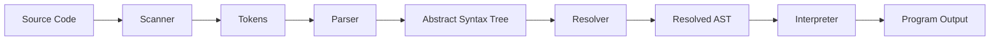

# Bobo

> A dynamically typed, object-oriented programming language implemented from scratch in Java.

Bobo is a handcrafted interpreted programming language built to explore every stage of language implementation: from lexical analysis and parsing to static name resolution and runtime execution. Rather than relying on parser generators or compiler frameworks, every major component is implemented manually, including the lexer, recursive-descent parser, Abstract Syntax Tree (AST), static resolver, and tree-walk interpreter.

The language supports variables, lexical scoping, first-class functions, closures, classes, inheritance, native functions, and an interactive REPL, providing many of the core features found in modern scripting languages while maintaining a clean, modular implementation.

Originally inspired by Robert Nystrom's *Crafting Interpreters*, Bobo has evolved beyond a direct implementation through custom language syntax, additional language features, modified runtime behavior, and an architecture designed to serve as a foundation for future experimentation, including a bytecode virtual machine.

Named after a beloved bonsai plant (RIP Bobo) gifted by my brother, the project is both a deep dive into programming language implementation and a long-term playground for exploring language design.


# Why Bobo?

Programming languages are often treated as black boxes. Source code goes in, and output comes out, with little visibility into the mechanisms that make execution possible. Bobo was built to understand that entire process by implementing each stage of an interpreter from first principles.

The project explores the complete execution pipeline, including lexical analysis, parsing, syntax tree construction, semantic analysis, runtime environments, and program evaluation. Every major subsystem is implemented manually without relying on parser generators, compiler frameworks, or language implementation libraries.

The goals of the project are to:

- Understand how modern interpreters are structured and implemented.
- Explore compiler construction concepts such as lexical analysis, recursive-descent parsing, abstract syntax trees, and static name resolution.
- Implement lexical scoping, closures, object-oriented programming, and runtime environments from scratch.
- Build a modular architecture that can be extended with new language features and alternative execution strategies.
- Create a long-term platform for experimenting with language design, including a future bytecode virtual machine.

Although Bobo began as an educational project inspired by *Crafting Interpreters*, it has evolved into an independent language implementation with its own syntax, project structure, runtime behavior, and planned language features.

# Features

### Language

- Dynamically typed language with automatic memory management
- Variables with lexical scoping and block-level scope
- First-class functions, closures, and recursion
- Classes, inheritance, constructors, and method overriding
- Native functions and built-in runtime utilities
- Interactive REPL and script execution
- Multi-line string literals
- `#` single-line comments
- Clear runtime and syntax error reporting

### Implementation

- Handwritten lexer built from scratch
- Recursive-descent parser with predictive parsing
- Abstract Syntax Tree (AST) generated using the Visitor pattern
- Static resolver for lexical scope analysis
- Tree-walk interpreter with chained runtime environments
- Modular architecture with well-separated compilation stages

### Developer Experience

- Clean project structure with independent components
- Comprehensive example programs
- Easily extensible language and runtime
- Designed as a foundation for a future bytecode virtual machine

## Project Highlights

- ~5,000 lines of Java
- 40+ source files
- Handwritten lexer and parser
- 30+ AST node types
- Static semantic analysis
- Object-oriented runtime with inheritance

# Quick Start

## Prerequisites

- Java 17 or later
- Git

## Clone the repository

```bash
git clone https://github.com/KhushiPandey1805/bobo.git
cd bobo
```

## Compile

```bash
javac -d out src/com/github/khushipandey1805/bobo/*.java
```

## Launch the REPL

```bash
java -cp out com.github.khushipandey1805.bobo.Bobo
```

You can also execute a script directly:

```bash
java -cp out com.github.khushipandey1805.bobo.Bobo examples/classes.bobo
```

Example:

```bobo
func fibonacci(n) {
    if (n <= 1) return n;
    return fibonacci(n - 1) + fibonacci(n - 2);
}

print fibonacci(10);
```

Output:

```text
55
```

# Project Structure

```text
bobo/
├── examples/                     # Sample Bobo programs
├── src/
│   └── com/github/khushipandey1805/bobo/
│       ├── Scanner.java          # Lexical analysis
│       ├── Parser.java           # Recursive-descent parser
│       ├── Expr.java             # Expression AST nodes
│       ├── Stmt.java             # Statement AST nodes
│       ├── Resolver.java         # Static scope analysis
│       ├── Interpreter.java      # Tree-walk interpreter
│       ├── Environment.java      # Runtime environments
│       ├── BoboClass.java        # Class representation
│       ├── BoboFunction.java     # Function objects & closures
│       ├── BoboInstance.java     # Object instances
│       ├── Token.java
│       ├── TokenType.java
│       ├── RuntimeError.java
│       └── ...
├── tools/
│   └── GenerateAst.java          # AST code generator
└── README.md
```

The interpreter is organized into independent stages that mirror the execution pipeline of a modern programming language.

| Component | Responsibility |
|-----------|----------------|
| **Scanner** | Converts source code into a stream of tokens. |
| **Parser** | Builds an Abstract Syntax Tree (AST) from the token stream. |
| **Resolver** | Performs static name resolution and computes lexical scope information. |
| **Interpreter** | Executes the AST using the Visitor pattern. |
| **Environment** | Maintains variable bindings and lexical scope at runtime. |
| **Runtime Objects** | Implements functions, classes, inheritance, instances, and native functions. |

# Architecture Overview

Bobo follows a traditional interpreter pipeline, where source code is transformed through several well-defined stages before being executed. Each stage is implemented as an independent component with a single responsibility, making the interpreter easier to understand, test, and extend.



The execution pipeline consists of four major stages:

### 1. Lexical Analysis

The scanner reads the source code character by character and converts it into a sequence of tokens. These tokens represent the smallest meaningful units of the language, such as keywords, identifiers, operators, literals, and punctuation.

### 2. Parsing

The parser consumes the token stream and constructs an Abstract Syntax Tree (AST) using a handwritten recursive-descent parser. The AST captures the structure of the program independently of its original source code.

### 3. Static Resolution

Before execution begins, the resolver performs semantic analysis by determining the lexical scope of every variable reference. This pass computes how many environments away each variable is defined, allowing the interpreter to perform efficient variable lookups during execution.

### 4. Interpretation

The interpreter walks the resolved AST using the Visitor pattern. Runtime environments maintain variable bindings, function calls, closures, and object instances while expressions and statements are evaluated.

This separation between scanning, parsing, semantic analysis, and execution keeps the implementation modular and allows each stage to evolve independently without affecting the rest of the interpreter.

# Implementation Details

## Lexical Analysis

The scanner is responsible for converting raw source code into a sequence of tokens that can be understood by the parser. It processes the input one character at a time, recognizing keywords, identifiers, literals, operators, punctuation, and comments while tracking line numbers for accurate error reporting.

The scanner performs only lexical analysis. It does not attempt to understand program structure or semantics, allowing later stages to operate on a clean stream of tokens.

---

## Parsing

Bobo uses a handwritten recursive-descent parser to transform the token stream into an Abstract Syntax Tree (AST). Each grammar rule is implemented as a dedicated parsing function, making the grammar easy to read, modify, and extend.

Expressions are parsed using recursive descent with precedence encoded directly in the parser structure, producing an AST that preserves the hierarchical structure of the program independently of its original source code.

The AST itself is generated automatically using the `GenerateAst` utility, eliminating repetitive boilerplate while maintaining a strongly typed representation of expressions and statements.

---

## Static Name Resolution

Before execution begins, the resolver performs a semantic analysis pass over the AST.

Its primary responsibility is to determine where every variable is defined within the lexical scope hierarchy. Instead of searching through environments during execution, the resolver computes the distance between each variable reference and its defining scope ahead of time.

This approach enables efficient variable lookup during interpretation while preserving lexical scoping, nested functions, and closures.

The resolver also detects several semantic errors before execution, such as invalid variable access and incorrect uses of `this` and `super`.

---

## Runtime Execution

The interpreter evaluates the resolved AST using the Visitor pattern. Each expression and statement type implements an `accept()` method, allowing execution logic to remain centralized inside the interpreter instead of being distributed throughout the AST.

Runtime environments form a chain representing nested lexical scopes. Variable declarations create bindings within the current environment, while function calls, blocks, and class methods introduce new environments linked to their enclosing scope.

This environment chain enables lexical scoping, closures, and recursive function calls while keeping variable lookup straightforward and efficient.

---

## Object-Oriented Runtime

Functions, classes, instances, and native functions are represented as first-class runtime objects.

Functions capture their enclosing environment when declared, allowing closures to retain access to variables after their original scope has exited.

Classes support inheritance, method overriding, constructors, and dynamic dispatch. Method lookup traverses the inheritance hierarchy at runtime, while `this` and `super` are resolved through the same lexical environment mechanism used elsewhere in the interpreter.

This unified runtime design keeps language features consistent while making new runtime types straightforward to add.

The combination of lexical analysis, parsing, semantic resolution, and runtime evaluation provides a complete execution pipeline capable of supporting procedural and object-oriented programs. The following examples demonstrate these language features in practice.

# Language Examples

The following examples demonstrate the core features of the Bobo language. Additional programs can be found in the [`examples/`](examples/) directory.

## Variables and Control Flow

```bobo
var total = 0;

for (var i = 1; i <= 10; i = i + 1) {
    total = total + i;
}

print total;
```

```
55
```

---

## Functions and Recursion

```bobo
func fibonacci(n) {
    if (n <= 1) return n;
    return fibonacci(n - 1) + fibonacci(n - 2);
}

print fibonacci(10);
```

```
55
```

---

## Closures

```bobo
func counter() {
    var count = 0;

    func next() {
        count = count + 1;
        return count;
    }

    return next;
}

var c = counter();

print c();
print c();
print c();
```

```
1
2
3
```

---

## Classes and Inheritance

```bobo
class Animal {
    speak() {
        print "Some sound";
    }
}

class Dog < Animal {
    speak() {
        print "Woof!";
    }
}

Dog().speak();
```

```
Woof!
```

---

## Multi-line Strings

```bobo
print """
Bobo
supports
multi-line strings.
""";
```

```
Bobo
supports
multi-line strings.
```

---

## Comments

```bobo
# This line is ignored.

print "Hello!";
```

```
Hello!
```

# Error Handling

Bobo reports errors at the earliest stage where they can be detected, providing clear diagnostics while preventing invalid programs from continuing through the execution pipeline.

| Error Type | Description |
|------------|-------------|
| **Lexical Errors** | Invalid or unexpected characters encountered during scanning. |
| **Syntax Errors** | Malformed program structure detected during parsing, with synchronization-based recovery to continue parsing subsequent statements where possible. |
| **Semantic Errors** | Invalid language constructs identified during static resolution, including incorrect variable usage and invalid references to `this` or `super`. |
| **Runtime Errors** | Errors encountered during execution, such as undefined variables, invalid operations, or incorrect function calls. |

All diagnostics include the relevant line number to simplify debugging and improve the development experience.

# Getting Started

## Requirements

Before building Bobo, ensure you have:

- Java 17 or later
- Git

## Building the Project

Clone the repository and compile the source files:

```bash
git clone https://github.com/KhushiPandey1805/bobo.git
cd bobo

javac -d out src/com/github/khushipandey1805/bobo/*.java
```

## Running the Interpreter

Start the interactive REPL:

```bash
java -cp out com.github.khushipandey1805.bobo.Bobo
```

Run a script:

```bash
java -cp out com.github.khushipandey1805.bobo.Bobo examples/classes.bobo
```

## Exploring the Project

If you're interested in the implementation, a good order for exploring the codebase is:

1. `Scanner.java`
2. `Parser.java`
3. `Expr.java` / `Stmt.java`
4. `Resolver.java`
5. `Environment.java`
6. `Interpreter.java`
7. Runtime classes (`BoboFunction`, `BoboClass`, `BoboInstance`)

This follows the same order in which source code flows through the interpreter, making it easier to understand the overall architecture.

## Extending the Language

Bobo is designed to be easy to extend. New language features typically involve changes to a small number of well-defined components:

- Add new tokens in `TokenType.java`
- Extend the scanner if new lexical constructs are introduced
- Update the parser grammar
- Add corresponding AST node types
- Implement resolution logic (if required)
- Implement runtime evaluation in the interpreter

Because each stage of the interpreter has a clearly defined responsibility, new language features can usually be implemented without significant changes to unrelated components.

# Roadmap

Bobo is an ongoing project, with several planned improvements aimed at expanding both the language and its implementation.

## Language Features

- [ ] Modules and package system
- [ ] Collection types (lists, maps, sets)
- [ ] Exception handling
- [ ] Anonymous functions and lambda expressions
- [ ] Pattern matching
- [ ] Operator overloading

## Runtime and Performance

- [ ] Bytecode compiler and virtual machine
- [ ] Garbage collection
- [ ] Optimized method dispatch
- [ ] Standard library expansion
- [ ] Performance benchmarking

## Developer Tooling

- [ ] Improved REPL experience
- [ ] Syntax highlighting support
- [ ] Language Server Protocol (LSP) integration
- [ ] Formatter and linter
- [ ] Documentation website

The long-term goal is to evolve Bobo from a tree-walk interpreter into a complete language platform while preserving the modular architecture established in the current implementation.

# Acknowledgements

Bobo was originally inspired by Robert Nystrom's excellent book, *Crafting Interpreters*, which provides an accessible introduction to programming language implementation.

While many of the core concepts and overall architecture draw inspiration from the book, the project has evolved beyond a direct implementation through custom language features, project organization, runtime behavior, and planned extensions.

If you're interested in interpreters or compiler construction, I highly recommend reading *Crafting Interpreters*:

https://craftinginterpreters.com/

---

If you have suggestions, find a bug, or would like to contribute, feel free to open an issue or submit a pull request.